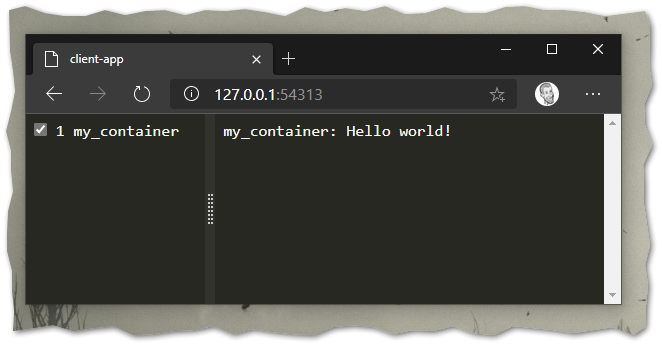

Receive (Docker) logs in GELF format from UDP, send it to Azure Monitor via REST API

### Getting started

Open a terminal and launch gelf2azure docker container:

```
docker run --rm -it -p 12201:12201/udp -p 54313:54313 gimmi/gelf2azure:latest
```

Open with your browser http://127.0.0.1:54313

Open another terminal and send sample log from a Docker container

```
docker run --rm -it \
  --name my_container \
  --log-driver gelf \
  --log-opt gelf-address=udp://127.0.0.1:12201 \
  alpine echo 'Hello world!'
```

You should see the log "Hello world!" appear in the browser window:



Message can be sent from any source, as long as GELF format is used. The following example uses `netcat` to send message:

```
nc.exe -u 127.0.0.1 12201
{ "host": "example.org", "short_message": "xoxo", "timestamp": 1602850875.683, "_container_name": "agitated_goldberg" }
```

### Build from sources

```
docker build --pull `
    --build-arg HTTP_PROXY=http://my.proxy.com:80 `
    --build-arg HTTPS_PROXY=http://my.proxy.com:80 `
    -t gelf2azure:latest .
```

### Setup Docker to send logs to gelf2azure

```
vi /etc/docker/daemon.json

{
    "log-driver": "gelf",
    "log-opts": {
        "gelf-address": "udp://172.16.0.13:12201"
    }
}
```
